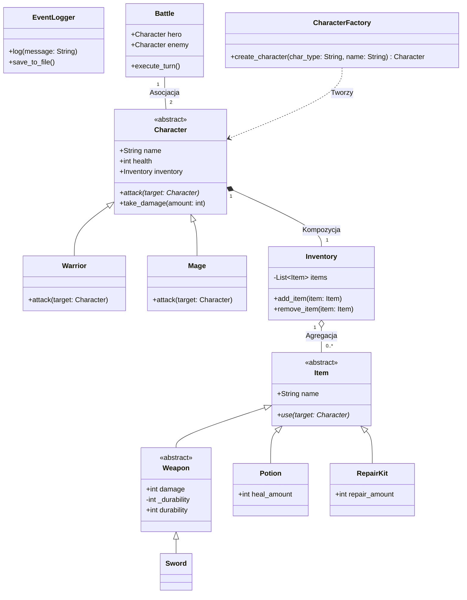

# ⚔️ my_rpg_engine - Projekt Zaliczeniowy OOP (Python)

**Autor:** [Twoje Imię i Nazwisko]

**Przedmiot:** Programowanie Obiektowe (Semestr 4)

**Cel projektu:** Stworzenie tekstowego silnika gry RPG realizującego zasady SOLID, wzorce projektowe (Factory, Observer) oraz 4 filary OOP.

---

## 1. User Stories (Historyjki Użytkownika)

1. **Jako gracz,** chcę, aby proces tworzenia bohatera był zautomatyzowany (Wojownik, Mag, Łucznik), aby natychmiast otrzymać postać z podstawowym ekwipunkiem.
2. **Jako poszukiwacz przygód,** chcę dodawać i usuwać przedmioty z ekwipunku, aby zarządzać swoimi zasobami.
3. **Jako taktyk,** chcę dbać o stan mojej broni (wytrzymałość/durability), a w razie jej zużycia móc użyć zestawu naprawczego, aby przywrócić jej pełne obrażenia.
4. **Jako ranny bohater,** chcę używać mikstur leczniczych w trakcie walki, aby uniknąć śmierci.
5. **Jako programista/gracz,** chcę czytać przejrzysty log ze wszystkich wydarzeń (walka, podnoszenie przedmiotów), który jest niezależny od logiki samej gry.

---

## 2. Architektura i Diagram Klas

Projekt wykorzystuje minimum 8 klas i realizuje zaawansowane relacje obiektowe. Warstwa logiki (postacie, walka) jest oddzielona od warstwy prezentacji (wyświetlanie tekstu) za pomocą wzorca **Observer**.

### Kluczowe Relacje (UML):

- **Kompozycja:** `Character ◆── Inventory` (Ekwipunek ginie razem z postacią).
- **Agregacja:** `Inventory ◇── Item` (Przedmioty mogą istnieć poza ekwipunkiem).
- **Asocjacja:** `Battle ── Character` (Bitwa przeprowadza interakcję między niezależnymi postaciami).
- **Zależność (Dependency):** `CharacterFactory ──> Character` (Fabryka tworzy obiekty postaci).

### Diagram Klas (Mermaid)



## 3. Realizacja Wymagań Technicznych (Mapa Projektu)

### 4 Filary OOP:

- **Abstrakcja:** Moduł abc dla bazowych klas Character i Item.
- **Hermetyzacja (@property):** Zastosowana m.in. w klasie Weapon. Atrybut prywatny _durability jest modyfikowany przez setter. Jeśli spadnie do 0, metoda obliczająca obrażenia redukuje atak bohatera do minimum (walka wręcz).
- **Dziedziczenie:** Hierarchia przedmiotów (Item -> Weapon -> Sword) oraz postaci (Character -> Mage).
- **Polimorfizm:** Różne implementacje metody attack() (Wojownik zużywa broń, Mag zużywa manę) oraz use() w przedmiotach.

### Wzorce Projektowe (Bonus):

- **Factory Method:** CharacterFactory zarządza tworzeniem postaci i ich startowym ekwipunkiem.
- **Observer (Logger):** Klasy nie używają print(). Zamiast tego wysyłają komunikaty do EventLogger, co spełnia zasadę Single Responsibility Principle (SRP) z SOLID.

### Metody specjalne (Dunder methods)

- **Metody specjalne (Dunder methods):** __str__ / __repr__ dla czytelnego wyświetlania logów i ekwipunku, __eq__ do porównywania i usuwania przedmiotów.

### Jakość kodu

- **Jakość kodu:** Typowanie (Type Hints), dokumentacja (Docstrings) oraz minimum 10 testów (pytest).

## 4. Plan Implementacji

- **Etap 1:** Fundamenty (Przedmioty i Hermetyzacja) - Definicja klas Item, Weapon z mechaniką durability (@property) oraz przedmiotów użytkowych (RepairKit, Potion).
- **Etap 2:** Logowanie i Ekwipunek - Wdrożenie EventLogger oraz klasy Inventory (kompozycja/agregacja).
- **Etap 3:** Aktorzy i Fabryka - Klasy Character, implementacja Warrior/Mage oraz stworzenie CharacterFactory.
- **Etap 4:** Silnik (Walka i Spięcie całości) - Klasa Battle obsługująca tury, testy jednostkowe pytest weryfikujące poprawność zużycia broni i obrażeń.

## 5. Struktura Katalogów

```text
my_rpg_engine/
├── engine/
│   ├── __init__.py
│   ├── base.py            # Klasy abstrakcyjne (Item, Character)
│   ├── items.py           # Klasy dziedziczące po Item (wytrzymałość broni)
│   ├── characters.py      # Klasy postaci
│   ├── factory.py         # CharacterFactory (Wzorzec Fabryki)
│   ├── inventory.py       # Ekwipunek (Kompozycja i agregacja)
│   ├── combat.py          # Logika walki (Battle)
│   └── logger.py          # EventLogger (Wzorzec Obserwatora)
├── tests/
│   ├── __init__.py
│   ├── test_items.py      # Testy durability i ekwipunku
│   └── test_combat.py
├── main.py                # Skrypt demonstracyjny gry
├── requirements.txt       # pytest
└── README.md              # Niniejszy dokument
```